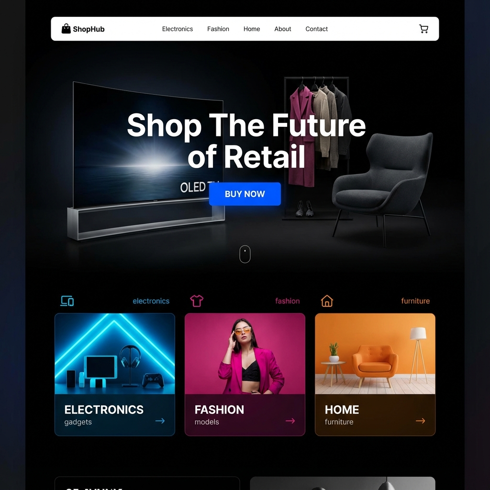

# ShopHub - MERN Stack E-commerce Application



ShopHub is a full-featured e-commerce platform built using the MERN (MongoDB, Express, React, Node.js) stack. It supports user authentication, product management, a shopping cart, and a dedicated admin dashboard for order and user management.

## 🚀 Key Features

- **User Authentication**: Secure signup and login with JWT and role-based access (User/Admin).
- **Product Catalog**: Diverse range of products across multiple categories with high-quality images.
- **Shopping Cart**: Fully functional cart with the ability to add/remove items and adjust quantities.
- **Checkout Process**: Integrated payment simulations with Stripe and Razorpay.
- **Admin Dashboard**:
  - Live statistics (Total Users, Total Orders, Total Revenue).
  - User management (View registered users).
  - Order management (Track recent orders and their details).
- **Email Notifications**: Automated welcome and login emails (requires configuration).

## 🛠️ Tech Stack

- **Frontend**: React, Redux Toolkit, Tailwind CSS, Lucide Icons, Vite.
- **Backend**: Node.js, Express.js, MongoDB (Mongoose), JWT, Bcrypt, Nodemailer.

## 📦 Project Structure

```bash
MERN-WD-11/
├── project/
│   ├── backend/        # Node.js/Express API
│   │   ├── controllers/ # Route handlers
│   │   ├── Schema/      # Mongoose models
│   │   └── index.js     # Entry point
│   └── front-end/      # React application
│       ├── src/
│       │   ├── components/  # UI Components
│       │   ├── redux/       # State management
│       │   └── product-api/ # Product data
│       └── index.html
└── .gitignore          # Root ignore file
```

## ⚙️ Setup Instructions

### 1. Prerequisites

- Node.js installed
- MongoDB URI (local or Atlas)

### 2. Backend Setup

1. Navigate to `project/backend`.
2. Install dependencies: `npm install`.
3. Create a `.env` file with:
   ```env
   MONGODB_URI=your_mongodb_uri
   JWT_SECRET=your_secret_key
   EMAIL_USER=your_email
   EMAIL_PASS=your_app_password
   ```
4. Start the server: `npm start`.

### 3. Frontend Setup

1. Navigate to `project/front-end`.
2. Install dependencies: `npm install`.
3. Start the application: `npm start`.

## 🛡️ License

Distributed under the MIT License.
